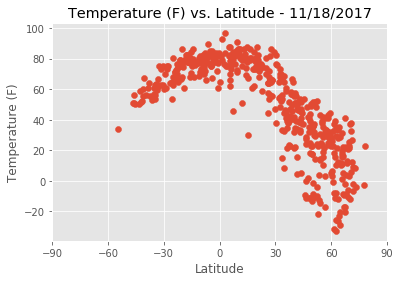
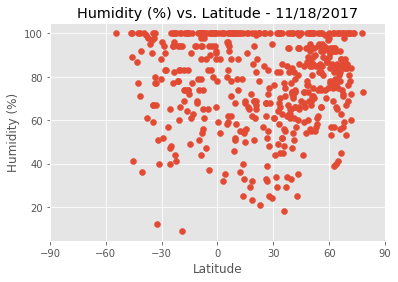
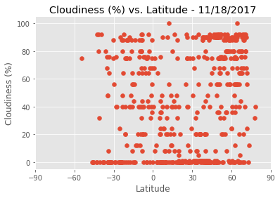
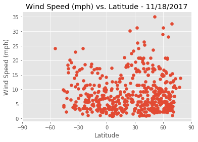

# WeatherPy
 - Most cities are in the northnern hemisphere
 - There is a definitive relationship between temperature and distance from the equator
 - It appears there is a less definitive relationship betweeen distance from the equator and windspeed. As you move farther from the equator, wind speeds are higher.


```python
import pandas as pd
import json
from config import api_key
from citipy import citipy
import requests
import matplotlib.pyplot as plt
import random
import datetime

weather_url = 'http://api.openweathermap.org/data/2.5/weather?'
```

## Generate List of Cities and Make API Calls


```python
number_of_cities = 500
cities = []
city_dicts = []
while len(cities) < number_of_cities:
    rand_lat = random.uniform(-90, 90)
    rand_lon = random.uniform(-180, 180)
    city = citipy.nearest_city(rand_lat, rand_lon)
    if city not in cities:
        city_name = city.city_name.replace(' ', '')
        country_code = city.country_code
        city_query_string = f'{city_name},{country_code}'
        params = {'appid': api_key,
                  'q': city_query_string,
                  'units': 'imperial'
                 }
        response = requests.get(weather_url, params=params)
        if response.status_code == 200:
            response_data = response.json()
            temp = response_data['main']['temp']
            humidity = response_data['main']['humidity']
            cloudiness = response_data['clouds']['all']
            wind_speed =  response_data['wind']['speed']
            lat = response_data['coord']['lat']
            lon = response_data['coord']['lon']
            name = response_data['name']
            country = response_data['sys']['country']
            city_date = {'city': name, 'country': country, 'temp': temp,
                         'humidity': humidity, 'cloudiness': cloudiness,
                         'wind_speed': wind_speed, 'lat': lat, 'long': lon}
            city_dicts.append(city_date)
            cities.append(city)
            print('%i - %s, %s' % (len(cities), name, country))
        else:
            pass
    else:
        pass
temperature_df = pd.DataFrame(city_dicts)
temperature_df['humidity']
temperature_df['cloudiness']
temperature_df.to_csv('open_weather_data.csv', index=False)
temperature_df
```

    1 - Busselton, AU
    2 - Lima, US
    3 - Hermanus, ZA
    4 - Uray, RU
    5 - Butaritari, KI
    6 - Koslan, RU
    7 - Tuktoyaktuk, CA
    8 - Bowen, AU
    9 - Lalibela, ET
    10 - Novochernorechenskiy, RU
    11 - Ixtapa, MX
    12 - Urubicha, BO
    13 - Narsaq, GL
    14 - Ushuaia, AR
    15 - Bluff, NZ
    16 - Mahebourg, MU
    17 - Soria, ES
    18 - Rikitea, PF
    19 - Vaini, TO
    20 - Bonavista, CA
    21 - Kapaa, US
    22 - Visnes, NO
    23 - Hit, IQ
    24 - Mwingi, KE
    25 - Tecalitlan, MX
    26 - Baruun-Urt, MN
    27 - Hobart, AU
    28 - Albany, AU
    29 - Port-Cartier, CA
    30 - Srednekolymsk, RU
    31 - Castro, CL
    32 - Pisco, PE
    33 - Nanortalik, GL
    34 - Durango, US
    35 - Souillac, MU
    36 - Saint-Francois, GP
    37 - Hithadhoo, MV
    38 - Chapais, CA
    39 - Oudtshoorn, ZA
    40 - Barrow, US
    41 - Nouadhibou, MR
    42 - Cariamanga, EC
    43 - Iqaluit, CA
    44 - Poum, NC
    45 - Jamestown, SH
    46 - Upernavik, GL
    47 - Dikson, RU
    48 - Qaanaaq, GL
    49 - Bengkulu, ID
    50 - Hilo, US
    51 - Ilulissat, GL
    52 - Laguna, BR
    53 - Khandyga, RU
    54 - Khatanga, RU
    55 - Sawtell, AU
    56 - Aitape, PG
    57 - Thompson, CA
    58 - Chuy, UY
    59 - Pokosnoye, RU
    60 - Grindavik, IS
    61 - Wanning, CN
    62 - Kirakira, SB
    63 - Kalianget, ID
    64 - Avarua, CK
    65 - Severnoye, RU
    66 - Whitecourt, CA
    67 - Nome, US
    68 - Chokurdakh, RU
    69 - Faanui, PF
    70 - Beringovskiy, RU
    71 - Togur, RU
    72 - Kodiak, US
    73 - Victoria, SC
    74 - Wawa, CA
    75 - Westport, IE
    76 - Kawalu, ID
    77 - Erzin, RU
    78 - Luau, AO
    79 - Ust-Nera, RU
    80 - Omboue, GA
    81 - Caravelas, BR
    82 - Sakaraha, MG
    83 - Katsuura, JP
    84 - Iwanai, JP
    85 - Mnogovershinnyy, RU
    86 - Panjakent, TJ
    87 - Miraflores, CO
    88 - Seoul, KR
    89 - Tautira, PF
    90 - Phalodi, IN
    91 - Shawnee, US
    92 - Yellowknife, CA
    93 - Saskylakh, RU
    94 - Severo-Kurilsk, RU
    95 - Waingapu, ID
    96 - Saint-Philippe, RE
    97 - Daru, PG
    98 - Pevek, RU
    99 - Waipawa, NZ
    100 - Bredasdorp, ZA
    101 - Lavrentiya, RU
    102 - Kidal, ML
    103 - Kloulklubed, PW
    104 - Blyth, GB
    105 - Lorengau, PG
    106 - Egvekinot, RU
    107 - Sitka, US
    108 - Pozhva, RU
    109 - Ostrovnoy, RU
    110 - Lander, US
    111 - Tura, RU
    112 - Negombo, LK
    113 - Tiarei, PF
    114 - Iskateley, RU
    115 - Luderitz, NA
    116 - Cabimas, VE
    117 - Manadhoo, MV
    118 - Bereznik, RU
    119 - Atuona, PF
    120 - Yerbogachen, RU
    121 - Niquelandia, BR
    122 - Havoysund, NO
    123 - Turayf, SA
    124 - Lompoc, US
    125 - Rocha, UY
    126 - Abramovka, RU
    127 - Bethel, US
    128 - Izvestkovyy, RU
    129 - Port-Gentil, GA
    130 - Vardo, NO
    131 - Namibe, AO
    132 - Gizo, SB
    133 - Ryotsu, JP
    134 - Namatanai, PG
    135 - Dingli, MT
    136 - Torbay, CA
    137 - Iringa, TZ
    138 - Eureka, US
    139 - Mulege, MX
    140 - Rolla, US
    141 - Puri, IN
    142 - Razole, IN
    143 - Komsomolskiy, RU
    144 - Olinda, BR
    145 - Stornoway, GB
    146 - Iracoubo, GF
    147 - Georgetown, SH
    148 - Nishihara, JP
    149 - Alvand, IR
    150 - Viedma, AR
    151 - Alugan, PH
    152 - Kyaikkami, MM
    153 - Luancheng, CN
    154 - Ensley, US
    155 - Alofi, NU
    156 - Zhengjiatun, CN
    157 - Okha, IN
    158 - Carnarvon, AU
    159 - Calama, CL
    160 - Maniitsoq, GL
    161 - Bukachacha, RU
    162 - Aklavik, CA
    163 - Matagami, CA
    164 - Guadix, ES
    165 - Daoukro, CI
    166 - Bathsheba, BB
    167 - Kigoma, TZ
    168 - Fallon, US
    169 - Antofagasta, CL
    170 - Nokia, FI
    171 - Cidreira, BR
    172 - Severo-Yeniseyskiy, RU
    173 - Mitsamiouli, KM
    174 - Florianopolis, BR
    175 - Leningradskiy, RU
    176 - Yumen, CN
    177 - Morondava, MG
    178 - Maragogi, BR
    179 - Cabedelo, BR
    180 - Sebinkarahisar, TR
    181 - Anaco, VE
    182 - Kavaratti, IN
    183 - Tevaitoa, PF
    184 - Mandera, KE
    185 - Tasiilaq, GL
    186 - Kargil, IN
    187 - Sept-Iles, CA
    188 - Kanniyakumari, IN
    189 - Broome, AU
    190 - Salta, AR
    191 - Toledo, ES
    192 - Touros, BR
    193 - Vestmannaeyjar, IS
    194 - Quelimane, MZ
    195 - Portland, AU
    196 - Carinhanha, BR
    197 - Scarborough, TT
    198 - Jiayuguan, CN
    199 - Bonham, US
    200 - Menongue, AO
    201 - Yilan, CN
    202 - Sola, VU
    203 - Vao, NC
    204 - Esik, KZ
    205 - Superior, US
    206 - Lixourion, GR
    207 - Tiksi, RU
    208 - Veraval, IN
    209 - Coquimbo, CL
    210 - Zaozerne, UA
    211 - Verkhovazhye, RU
    212 - Bezhanitsy, RU
    213 - Reconquista, AR
    214 - Hirara, JP
    215 - Adre, TD
    216 - Saint-Ambroise, CA
    217 - Vauvert, FR
    218 - Cherskiy, RU
    219 - Maceio, BR
    220 - Slobodskoy, RU
    221 - Dombarovskiy, RU
    222 - Flinders, AU
    223 - Kavieng, PG
    224 - Katol, IN
    225 - Graham, US
    226 - Camacha, PT
    227 - Funabashi, JP
    228 - Colares, PT
    229 - Kysyl-Syr, RU
    230 - Cayenne, GF
    231 - Magdagachi, RU
    232 - Hastings, NZ
    233 - Kishi, NG
    234 - Narsingi, IN
    235 - Golden, CA
    236 - Taywarah, AF
    237 - Awbari, LY
    238 - Obo, CF
    239 - Topeka, US
    240 - Adrar, DZ
    241 - Dunedin, NZ
    242 - Shalinskoye, RU
    243 - Naze, JP
    244 - Lucapa, AO
    245 - Ancud, CL
    246 - Rockland, US
    247 - Cooma, AU
    248 - Kommunisticheskiy, RU
    249 - Oranjemund, NA
    250 - Kisiwani, TZ
    251 - Fortuna, US
    252 - Skibbereen, IE
    253 - Taltal, CL
    254 - Poronaysk, RU
    255 - Saldanha, ZA
    256 - Coihaique, CL
    257 - Woodstock, CA
    258 - Troitsko-Pechorsk, RU
    259 - Belen, PY
    260 - Mezhdurechensk, RU
    261 - Borogontsy, RU
    262 - Kutum, SD
    263 - Karratha, AU
    264 - Zhicheng, CN
    265 - Hamilton, BM
    266 - Kamen-na-Obi, RU
    267 - Victoria, AR
    268 - Sisimiut, GL
    269 - Montepuez, MZ
    270 - Singapore, SG
    271 - Carballo, ES
    272 - Lebu, CL
    273 - Berlevag, NO
    274 - Polovinnoye, RU
    275 - Kahului, US
    276 - Suntar, RU
    277 - Huarmey, PE
    278 - Strelka, RU
    279 - Erchie, IT
    280 - Nadym, RU
    281 - Celestun, MX
    282 - Tezu, IN
    283 - Isangel, VU
    284 - Asuncion, PY
    285 - Klaksvik, FO
    286 - Aloleng, PH
    287 - Kaeo, NZ
    288 - Pangnirtung, CA
    289 - Havelock, US
    290 - Cairo, US
    291 - Labuhan, ID
    292 - Zhigansk, RU
    293 - Bonfim, BR
    294 - Ures, MX
    295 - Dwarka, IN
    296 - Ginir, ET
    297 - Inta, RU
    298 - Deputatskiy, RU
    299 - Solnechnyy, RU
    300 - Hasaki, JP
    301 - Lalsot, IN
    302 - Mersing, MY
    303 - Stephenville, US
    304 - Campbellton, CA
    305 - Arona, ES
    306 - Udachnyy, RU
    307 - Winnemucca, US
    308 - Nakamura, JP
    309 - Mondeville, FR
    310 - Itoman, JP
    311 - Tual, ID
    312 - Denpasar, ID
    313 - Havre, US
    314 - Tromso, NO
    315 - Urusha, RU
    316 - Moanda, GA
    317 - Morehead, PG
    318 - Mahajanga, MG
    319 - Tomatlan, MX
    320 - Pescia, IT
    321 - Oyama, JP
    322 - Nautla, MX
    323 - Kununurra, AU
    324 - Erzurum, TR
    325 - Tabas, IR
    326 - Praia, CV
    327 - Tobolsk, RU
    328 - Noshiro, JP
    329 - Husavik, IS
    330 - Provideniya, RU
    331 - Batagay, RU
    332 - Roros, NO
    333 - Geraldton, CA
    334 - Challapata, BO
    335 - Teluknaga, ID
    336 - Imbituba, BR
    337 - College, US
    338 - Petropavlovsk-Kamchatskiy, RU
    339 - Vary, UA
    340 - Amberley, NZ
    341 - Fukue, JP
    342 - Athabasca, CA
    343 - Salalah, OM
    344 - Nohfelden, DE
    345 - Esperance, AU
    346 - Cascais, PT
    347 - Taoudenni, ML
    348 - Karwar, IN
    349 - Gushikawa, JP
    350 - Tarazona, ES
    351 - Sheboygan, US
    352 - Saint-Joseph, RE
    353 - Ayan, RU
    354 - Longyearbyen, SJ
    355 - Itaunja, IN
    356 - Halifax, CA
    357 - Ketchikan, US
    358 - Marathon, US
    359 - Braganca, BR
    360 - Hualmay, PE
    361 - Aracaju, BR
    362 - Alice, US
    363 - Aksarka, RU
    364 - Valera, VE
    365 - Salinopolis, BR
    366 - Tiznit, MA
    367 - Anloga, GH
    368 - Valparaiso, CL
    369 - Najran, SA
    370 - Shahapur, IN
    371 - Douentza, ML
    372 - Tilichiki, RU
    373 - Nhulunbuy, AU
    374 - Manakara, MG
    375 - Ossora, RU
    376 - Dunda, TZ
    377 - Kristiansand, NO
    378 - Bako, ET
    379 - Takoradi, GH
    380 - Luoyang, CN
    381 - Arman, RU
    382 - Prattville, US
    383 - Svetlogorsk, RU
    384 - Plaisance-du-Touch, FR
    385 - Alpine, US
    386 - Kangaba, ML
    387 - Sur, OM
    388 - Thayetmyo, MM
    389 - Kalaswala, PK
    390 - Sayyan, YE
    391 - Sorland, NO
    392 - Varzelandia, BR
    393 - Dingle, IE
    394 - Haverfordwest, GB
    395 - Mandalgovi, MN
    396 - Nicoya, CR
    397 - Urzhum, RU
    398 - Yola, NG
    399 - Angol, CL
    400 - Boyolangu, ID
    401 - Ocos, GT
    402 - Baykit, RU
    403 - Sangar, RU
    404 - Saint-Michel-des-Saints, CA
    405 - Cabra, PH
    406 - Zaysan, KZ
    407 - Tamano, JP
    408 - Hobyo, SO
    409 - Bilma, NE
    410 - Trat, TH
    411 - Ust-Koksa, RU
    412 - Lanivtsi, UA
    413 - Tarakan, ID
    414 - Asyut, EG
    415 - Playas, EC
    416 - Kangaatsiaq, GL
    417 - Yeppoon, AU
    418 - Merauke, ID
    419 - Fontem, CM
    420 - Nakhabino, RU
    421 - Rjukan, NO
    422 - Chenzhou, CN
    423 - Penzance, GB
    424 - Verkhoyansk, RU
    425 - Novobelokatay, RU
    426 - Ulety, RU
    427 - Buraydah, SA
    428 - Boundiali, CI
    429 - Zwedru, LR
    430 - Tucuma, BR
    431 - Mtimbira, TZ
    432 - Ternate, ID
    433 - Middelburg, ZA
    434 - Farmington, US
    435 - Ucluelet, CA
    436 - Skrunda, LV
    437 - Dauriya, RU
    438 - Pimampiro, EC
    439 - Umuarama, BR
    440 - Yakuplu, TR
    441 - Inhambane, MZ
    442 - Korla, CN
    443 - Albania, CO
    444 - Fuzhou, CN
    445 - Zaragoza, ES
    446 - Balabac, PH
    447 - Gorin, RU
    448 - Batagay-Alyta, RU
    449 - Orlik, RU
    450 - Ust-Kuyga, RU
    451 - Drabiv, UA
    452 - Rafaela, AR
    453 - Ende, ID
    454 - Ulaanbaatar, MN
    455 - Sulphur, US
    456 - Pangody, RU
    457 - Batsfjord, NO
    458 - Hamilton, US
    459 - Maxixe, MZ
    460 - Kenai, US
    461 - Amarante, BR
    462 - Piranhas, BR
    463 - Moussoro, TD
    464 - Atasu, KZ
    465 - Affery, CI
    466 - Knyaze-Volkonskoye, RU
    467 - Gornyak, RU
    468 - Tacuarembo, UY
    469 - Hambantota, LK
    470 - Evensk, RU
    471 - Praya, ID
    472 - Kilifi, KE
    473 - Burnie, AU
    474 - Dhidhdhoo, MV
    475 - Kautokeino, NO
    476 - Roald, NO
    477 - Ust-Kut, RU
    478 - Mayumba, GA
    479 - Konstantinovo, RU
    480 - Guatire, VE
    481 - Ormara, PK
    482 - Lagoa, PT
    483 - Shingu, JP
    484 - Ferme-Neuve, CA
    485 - Paraiso, MX
    486 - Whitehorse, CA
    487 - Messina, IT
    488 - Tornio, FI
    489 - Manukan, PH
    490 - Ostersund, SE
    491 - Shelburne, CA
    492 - Ridgecrest, US
    493 - Makinsk, KZ
    494 - Linjiang, CN
    495 - Smolenka, RU
    496 - Nemuro, JP
    497 - Tuatapere, NZ
    498 - Dori, BF
    499 - Minamata, JP
    500 - Abhar, IR
    


<div>
<style>
    .dataframe thead tr:only-child th {
        text-align: right;
    }

    .dataframe thead th {
        text-align: left;
    }

    .dataframe tbody tr th {
        vertical-align: top;
    }
</style>
<table border="1" class="dataframe">
  <thead>
    <tr style="text-align: right;">
      <th></th>
      <th>city</th>
      <th>cloudiness</th>
      <th>country</th>
      <th>humidity</th>
      <th>lat</th>
      <th>long</th>
      <th>temp</th>
      <th>wind_speed</th>
    </tr>
  </thead>
  <tbody>
    <tr>
      <th>0</th>
      <td>Busselton</td>
      <td>76</td>
      <td>AU</td>
      <td>100</td>
      <td>-33.65</td>
      <td>115.33</td>
      <td>61.12</td>
      <td>10.87</td>
    </tr>
    <tr>
      <th>1</th>
      <td>Lima</td>
      <td>90</td>
      <td>US</td>
      <td>100</td>
      <td>40.74</td>
      <td>-84.11</td>
      <td>55.99</td>
      <td>16.11</td>
    </tr>
    <tr>
      <th>2</th>
      <td>Hermanus</td>
      <td>0</td>
      <td>ZA</td>
      <td>59</td>
      <td>-34.42</td>
      <td>19.23</td>
      <td>63.23</td>
      <td>3.71</td>
    </tr>
    <tr>
      <th>3</th>
      <td>Uray</td>
      <td>80</td>
      <td>RU</td>
      <td>89</td>
      <td>60.12</td>
      <td>64.78</td>
      <td>23.09</td>
      <td>5.84</td>
    </tr>
    <tr>
      <th>4</th>
      <td>Butaritari</td>
      <td>0</td>
      <td>KI</td>
      <td>100</td>
      <td>3.07</td>
      <td>172.79</td>
      <td>83.44</td>
      <td>1.14</td>
    </tr>
    <tr>
      <th>5</th>
      <td>Koslan</td>
      <td>88</td>
      <td>RU</td>
      <td>84</td>
      <td>63.46</td>
      <td>48.90</td>
      <td>33.17</td>
      <td>7.29</td>
    </tr>
    <tr>
      <th>6</th>
      <td>Tuktoyaktuk</td>
      <td>90</td>
      <td>CA</td>
      <td>84</td>
      <td>69.45</td>
      <td>-133.04</td>
      <td>3.20</td>
      <td>9.17</td>
    </tr>
    <tr>
      <th>7</th>
      <td>Bowen</td>
      <td>75</td>
      <td>AU</td>
      <td>94</td>
      <td>-20.02</td>
      <td>148.23</td>
      <td>68.00</td>
      <td>1.12</td>
    </tr>
    <tr>
      <th>8</th>
      <td>Lalibela</td>
      <td>0</td>
      <td>ET</td>
      <td>55</td>
      <td>12.03</td>
      <td>39.03</td>
      <td>50.77</td>
      <td>1.92</td>
    </tr>
    <tr>
      <th>9</th>
      <td>Novochernorechenskiy</td>
      <td>36</td>
      <td>RU</td>
      <td>85</td>
      <td>56.27</td>
      <td>91.08</td>
      <td>21.47</td>
      <td>6.06</td>
    </tr>
    <tr>
      <th>10</th>
      <td>Ixtapa</td>
      <td>0</td>
      <td>MX</td>
      <td>65</td>
      <td>20.70</td>
      <td>-105.20</td>
      <td>82.08</td>
      <td>2.04</td>
    </tr>
    <tr>
      <th>11</th>
      <td>Urubicha</td>
      <td>56</td>
      <td>BO</td>
      <td>72</td>
      <td>-15.38</td>
      <td>-62.95</td>
      <td>84.47</td>
      <td>4.72</td>
    </tr>
    <tr>
      <th>12</th>
      <td>Narsaq</td>
      <td>90</td>
      <td>GL</td>
      <td>57</td>
      <td>60.92</td>
      <td>-46.05</td>
      <td>23.00</td>
      <td>3.36</td>
    </tr>
    <tr>
      <th>13</th>
      <td>Ushuaia</td>
      <td>75</td>
      <td>AR</td>
      <td>100</td>
      <td>-54.80</td>
      <td>-68.30</td>
      <td>33.80</td>
      <td>24.16</td>
    </tr>
    <tr>
      <th>14</th>
      <td>Bluff</td>
      <td>0</td>
      <td>NZ</td>
      <td>100</td>
      <td>-46.60</td>
      <td>168.33</td>
      <td>50.63</td>
      <td>9.98</td>
    </tr>
    <tr>
      <th>15</th>
      <td>Mahebourg</td>
      <td>75</td>
      <td>MU</td>
      <td>83</td>
      <td>-20.41</td>
      <td>57.70</td>
      <td>77.00</td>
      <td>5.82</td>
    </tr>
    <tr>
      <th>16</th>
      <td>Soria</td>
      <td>0</td>
      <td>ES</td>
      <td>74</td>
      <td>41.76</td>
      <td>-2.47</td>
      <td>33.94</td>
      <td>2.37</td>
    </tr>
    <tr>
      <th>17</th>
      <td>Rikitea</td>
      <td>48</td>
      <td>PF</td>
      <td>100</td>
      <td>-23.12</td>
      <td>-134.97</td>
      <td>73.00</td>
      <td>18.59</td>
    </tr>
    <tr>
      <th>18</th>
      <td>Vaini</td>
      <td>75</td>
      <td>TO</td>
      <td>94</td>
      <td>-21.20</td>
      <td>-175.20</td>
      <td>78.80</td>
      <td>2.24</td>
    </tr>
    <tr>
      <th>19</th>
      <td>Bonavista</td>
      <td>48</td>
      <td>CA</td>
      <td>93</td>
      <td>48.65</td>
      <td>-53.11</td>
      <td>43.57</td>
      <td>3.60</td>
    </tr>
    <tr>
      <th>20</th>
      <td>Kapaa</td>
      <td>1</td>
      <td>US</td>
      <td>78</td>
      <td>22.08</td>
      <td>-159.32</td>
      <td>74.50</td>
      <td>4.70</td>
    </tr>
    <tr>
      <th>21</th>
      <td>Visnes</td>
      <td>75</td>
      <td>NO</td>
      <td>75</td>
      <td>59.36</td>
      <td>5.22</td>
      <td>44.60</td>
      <td>28.86</td>
    </tr>
    <tr>
      <th>22</th>
      <td>Hit</td>
      <td>36</td>
      <td>IQ</td>
      <td>82</td>
      <td>33.64</td>
      <td>42.83</td>
      <td>56.48</td>
      <td>7.74</td>
    </tr>
    <tr>
      <th>23</th>
      <td>Mwingi</td>
      <td>36</td>
      <td>KE</td>
      <td>91</td>
      <td>-0.93</td>
      <td>38.06</td>
      <td>61.07</td>
      <td>1.81</td>
    </tr>
    <tr>
      <th>24</th>
      <td>Tecalitlan</td>
      <td>5</td>
      <td>MX</td>
      <td>69</td>
      <td>19.47</td>
      <td>-103.30</td>
      <td>80.60</td>
      <td>11.41</td>
    </tr>
    <tr>
      <th>25</th>
      <td>Baruun-Urt</td>
      <td>0</td>
      <td>MN</td>
      <td>59</td>
      <td>46.68</td>
      <td>113.28</td>
      <td>-0.27</td>
      <td>10.20</td>
    </tr>
    <tr>
      <th>26</th>
      <td>Hobart</td>
      <td>0</td>
      <td>AU</td>
      <td>77</td>
      <td>-42.88</td>
      <td>147.33</td>
      <td>59.00</td>
      <td>6.93</td>
    </tr>
    <tr>
      <th>27</th>
      <td>Albany</td>
      <td>68</td>
      <td>AU</td>
      <td>91</td>
      <td>-35.02</td>
      <td>117.89</td>
      <td>60.71</td>
      <td>4.16</td>
    </tr>
    <tr>
      <th>28</th>
      <td>Port-Cartier</td>
      <td>75</td>
      <td>CA</td>
      <td>69</td>
      <td>50.03</td>
      <td>-66.87</td>
      <td>35.60</td>
      <td>6.93</td>
    </tr>
    <tr>
      <th>29</th>
      <td>Srednekolymsk</td>
      <td>68</td>
      <td>RU</td>
      <td>71</td>
      <td>67.45</td>
      <td>153.68</td>
      <td>-2.30</td>
      <td>7.96</td>
    </tr>
    <tr>
      <th>...</th>
      <td>...</td>
      <td>...</td>
      <td>...</td>
      <td>...</td>
      <td>...</td>
      <td>...</td>
      <td>...</td>
      <td>...</td>
    </tr>
    <tr>
      <th>470</th>
      <td>Praya</td>
      <td>68</td>
      <td>ID</td>
      <td>94</td>
      <td>-8.71</td>
      <td>116.27</td>
      <td>75.20</td>
      <td>4.47</td>
    </tr>
    <tr>
      <th>471</th>
      <td>Kilifi</td>
      <td>40</td>
      <td>KE</td>
      <td>83</td>
      <td>-3.63</td>
      <td>39.85</td>
      <td>81.82</td>
      <td>3.36</td>
    </tr>
    <tr>
      <th>472</th>
      <td>Burnie</td>
      <td>32</td>
      <td>AU</td>
      <td>92</td>
      <td>-41.07</td>
      <td>145.92</td>
      <td>60.40</td>
      <td>17.22</td>
    </tr>
    <tr>
      <th>473</th>
      <td>Dhidhdhoo</td>
      <td>48</td>
      <td>MV</td>
      <td>100</td>
      <td>6.88</td>
      <td>73.10</td>
      <td>80.97</td>
      <td>1.01</td>
    </tr>
    <tr>
      <th>474</th>
      <td>Kautokeino</td>
      <td>88</td>
      <td>NO</td>
      <td>84</td>
      <td>69.01</td>
      <td>23.04</td>
      <td>20.80</td>
      <td>3.91</td>
    </tr>
    <tr>
      <th>475</th>
      <td>Roald</td>
      <td>0</td>
      <td>NO</td>
      <td>100</td>
      <td>62.58</td>
      <td>6.13</td>
      <td>34.68</td>
      <td>16.11</td>
    </tr>
    <tr>
      <th>476</th>
      <td>Ust-Kut</td>
      <td>64</td>
      <td>RU</td>
      <td>81</td>
      <td>56.79</td>
      <td>105.77</td>
      <td>2.89</td>
      <td>2.35</td>
    </tr>
    <tr>
      <th>477</th>
      <td>Mayumba</td>
      <td>92</td>
      <td>GA</td>
      <td>100</td>
      <td>-3.43</td>
      <td>10.66</td>
      <td>76.96</td>
      <td>8.05</td>
    </tr>
    <tr>
      <th>478</th>
      <td>Konstantinovo</td>
      <td>80</td>
      <td>RU</td>
      <td>89</td>
      <td>56.55</td>
      <td>38.03</td>
      <td>31.96</td>
      <td>9.17</td>
    </tr>
    <tr>
      <th>479</th>
      <td>Guatire</td>
      <td>40</td>
      <td>VE</td>
      <td>79</td>
      <td>10.48</td>
      <td>-66.54</td>
      <td>86.00</td>
      <td>1.68</td>
    </tr>
    <tr>
      <th>480</th>
      <td>Ormara</td>
      <td>0</td>
      <td>PK</td>
      <td>85</td>
      <td>25.21</td>
      <td>64.64</td>
      <td>69.72</td>
      <td>12.19</td>
    </tr>
    <tr>
      <th>481</th>
      <td>Lagoa</td>
      <td>76</td>
      <td>PT</td>
      <td>100</td>
      <td>39.05</td>
      <td>-27.98</td>
      <td>66.88</td>
      <td>18.90</td>
    </tr>
    <tr>
      <th>482</th>
      <td>Shingu</td>
      <td>0</td>
      <td>JP</td>
      <td>100</td>
      <td>33.73</td>
      <td>135.98</td>
      <td>53.65</td>
      <td>20.83</td>
    </tr>
    <tr>
      <th>483</th>
      <td>Ferme-Neuve</td>
      <td>68</td>
      <td>CA</td>
      <td>85</td>
      <td>46.70</td>
      <td>-75.45</td>
      <td>27.10</td>
      <td>3.58</td>
    </tr>
    <tr>
      <th>484</th>
      <td>Paraiso</td>
      <td>75</td>
      <td>MX</td>
      <td>62</td>
      <td>18.40</td>
      <td>-93.23</td>
      <td>84.20</td>
      <td>9.17</td>
    </tr>
    <tr>
      <th>485</th>
      <td>Whitehorse</td>
      <td>40</td>
      <td>CA</td>
      <td>77</td>
      <td>60.72</td>
      <td>-135.05</td>
      <td>-0.41</td>
      <td>9.17</td>
    </tr>
    <tr>
      <th>486</th>
      <td>Messina</td>
      <td>40</td>
      <td>IT</td>
      <td>82</td>
      <td>38.19</td>
      <td>15.55</td>
      <td>58.05</td>
      <td>11.41</td>
    </tr>
    <tr>
      <th>487</th>
      <td>Tornio</td>
      <td>0</td>
      <td>FI</td>
      <td>92</td>
      <td>65.85</td>
      <td>24.13</td>
      <td>17.60</td>
      <td>8.05</td>
    </tr>
    <tr>
      <th>488</th>
      <td>Manukan</td>
      <td>24</td>
      <td>PH</td>
      <td>100</td>
      <td>8.53</td>
      <td>123.10</td>
      <td>76.33</td>
      <td>3.69</td>
    </tr>
    <tr>
      <th>489</th>
      <td>Ostersund</td>
      <td>90</td>
      <td>SE</td>
      <td>92</td>
      <td>63.18</td>
      <td>14.64</td>
      <td>21.20</td>
      <td>4.70</td>
    </tr>
    <tr>
      <th>490</th>
      <td>Shelburne</td>
      <td>90</td>
      <td>CA</td>
      <td>93</td>
      <td>44.08</td>
      <td>-80.20</td>
      <td>44.65</td>
      <td>5.82</td>
    </tr>
    <tr>
      <th>491</th>
      <td>Ridgecrest</td>
      <td>1</td>
      <td>US</td>
      <td>18</td>
      <td>35.62</td>
      <td>-117.67</td>
      <td>59.00</td>
      <td>4.16</td>
    </tr>
    <tr>
      <th>492</th>
      <td>Makinsk</td>
      <td>76</td>
      <td>KZ</td>
      <td>90</td>
      <td>52.63</td>
      <td>70.42</td>
      <td>24.13</td>
      <td>10.85</td>
    </tr>
    <tr>
      <th>493</th>
      <td>Linjiang</td>
      <td>48</td>
      <td>CN</td>
      <td>73</td>
      <td>41.81</td>
      <td>126.91</td>
      <td>4.24</td>
      <td>5.26</td>
    </tr>
    <tr>
      <th>494</th>
      <td>Smolenka</td>
      <td>40</td>
      <td>RU</td>
      <td>70</td>
      <td>52.14</td>
      <td>113.50</td>
      <td>-4.01</td>
      <td>4.47</td>
    </tr>
    <tr>
      <th>495</th>
      <td>Nemuro</td>
      <td>92</td>
      <td>JP</td>
      <td>100</td>
      <td>43.32</td>
      <td>145.57</td>
      <td>39.39</td>
      <td>19.13</td>
    </tr>
    <tr>
      <th>496</th>
      <td>Tuatapere</td>
      <td>0</td>
      <td>NZ</td>
      <td>100</td>
      <td>-46.13</td>
      <td>167.68</td>
      <td>51.13</td>
      <td>4.59</td>
    </tr>
    <tr>
      <th>497</th>
      <td>Dori</td>
      <td>24</td>
      <td>BF</td>
      <td>54</td>
      <td>14.04</td>
      <td>-0.03</td>
      <td>73.81</td>
      <td>3.69</td>
    </tr>
    <tr>
      <th>498</th>
      <td>Minamata</td>
      <td>0</td>
      <td>JP</td>
      <td>100</td>
      <td>32.22</td>
      <td>130.40</td>
      <td>48.43</td>
      <td>16.33</td>
    </tr>
    <tr>
      <th>499</th>
      <td>Abhar</td>
      <td>20</td>
      <td>IR</td>
      <td>71</td>
      <td>36.15</td>
      <td>49.22</td>
      <td>21.39</td>
      <td>1.57</td>
    </tr>
  </tbody>
</table>
<p>500 rows × 8 columns</p>
</div>


## Create Scatter Plots


```python
def create_latitude_scatter_plot(df, y_axis_col, y_axis_title):
    plt.style.use('ggplot')
    plt.scatter(df['lat'], df[y_axis_col])
    now = datetime.datetime.now()
    plt.title(f'{y_axis_title} vs. Latitude - {now.month}/{now.day}/{now.year}')
    plt.xlabel('Latitude')
    plt.ylabel(y_axis_title)
    plt.xlim(-90, 90)
    plt.xticks(range(-90, 91, 30))
    plt.savefig(f'{y_axis_title} {now.month}_{now.day}_{now.year}.png')
    plt.show()
```


```python
create_latitude_scatter_plot(temperature_df, 'temp', 'Temperature (F)')
```





```python
create_latitude_scatter_plot(temperature_df, 'humidity', 'Humidity (%)')
```





```python
create_latitude_scatter_plot(temperature_df, 'cloudiness', 'Cloudiness (%)')
```





```python
create_latitude_scatter_plot(temperature_df, 'wind_speed', 'Wind Speed (mph)')
```




